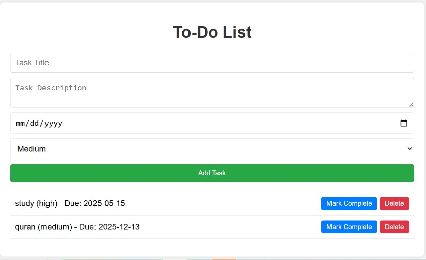

# 📝 To-Do List Web Application

  
  ## 📌 Features
- Add, update, delete, and view tasks.
- Filter tasks by priority, due date, and completion.
- Modern UI with a simple design.

## 🛠 Tech Stack
- **Frontend:** HTML, CSS, JavaScript
- **Backend:** Node.js, Express
- **Web Server:** Nginx
- **Containerization:** Docker
- **Orchestration:** Docker Compose

## 🚀 How to Run the Application

### 1. Clone the Repository

```bash
git clone https://github.com/alaamelek2004/todo-list.git
cd todo-list
```

### 2. Prerequisites

Make sure the following are installed on your system:
- Docker
- Docker Compose
- Git

### 3. Run the Application

```bash
docker-compose up -d
```

### 4. Access the Application

Open your browser and go to:
- Frontend: http://localhost:8080
- Backend API: http://localhost:3000/tasks

### 5. Stop the Application

```bash
docker-compose down
```

## 🐳 DockerHub Repositories

- **All Images:** https://hub.docker.com/repositories/alaamelek2004
- **Backend Image:** https://hub.docker.com/r/alaamelek2004/todo-list-backend
- **Frontend Image:** https://hub.docker.com/r/alaamelek2004/todo-list-frontend


## ❓ How Can Someone Run the App from GitHub?

### 1. Clone the Repository

```bash
git clone https://github.com/alaamelek2004/todo-list.git
cd todo-list
```

### 2. Install Prerequisites

Ensure Docker, Docker Compose, and Git are installed.

### 3. Run the App

```bash
docker-compose up -d
```

### 4. Access the Application

Open your browser and go to:
- Frontend: http://localhost:8080
- Backend API: http://localhost:3000/tasks

## 👥 Team

- **Alaa Melek**
- **Tasneem Taha**
- **Eman Mohamed**

## 📝 Notes

- Make sure ports 3000 and 8080 are free on your machine before running.
